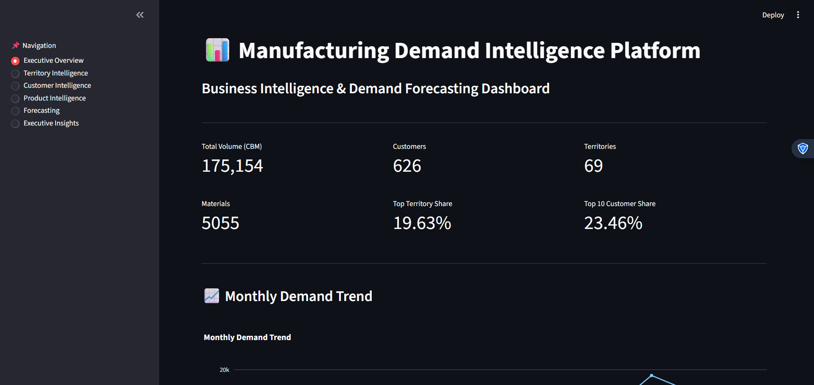
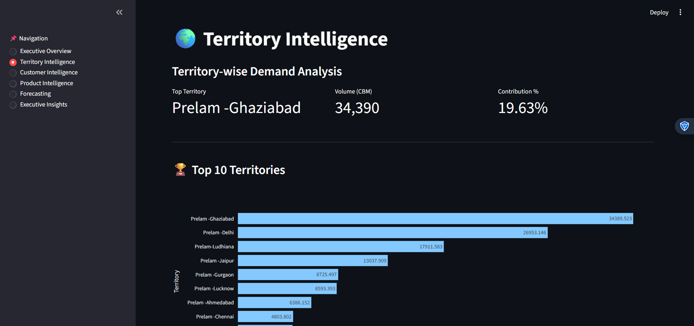
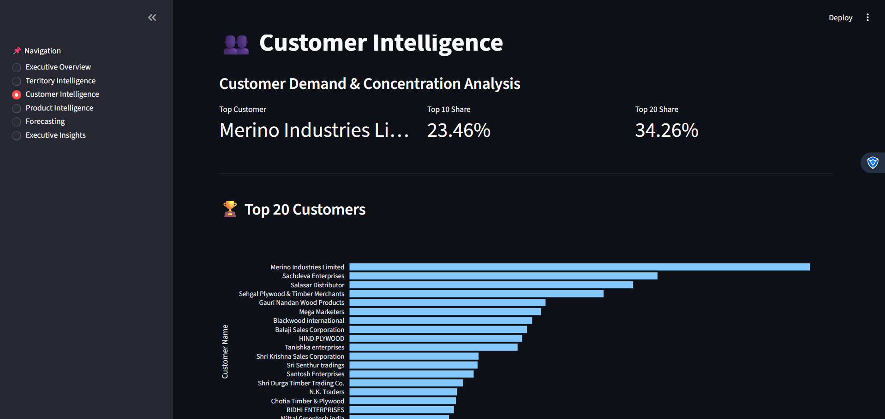
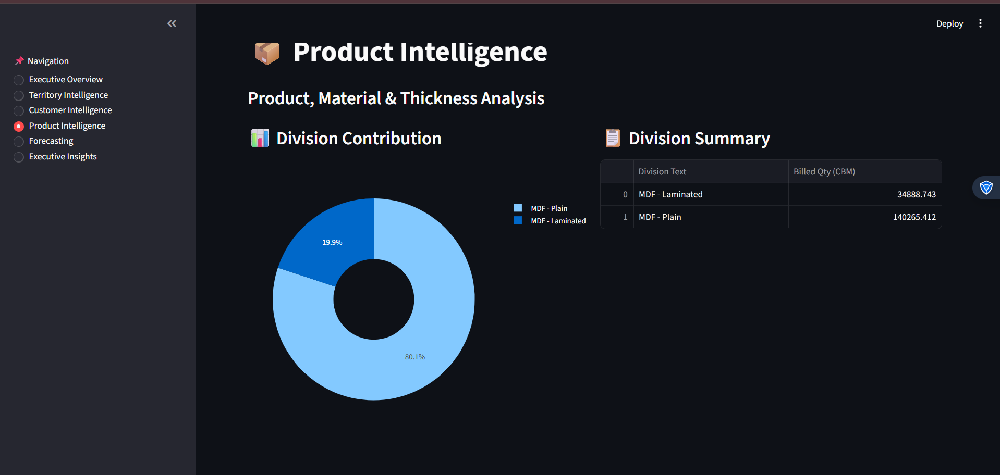
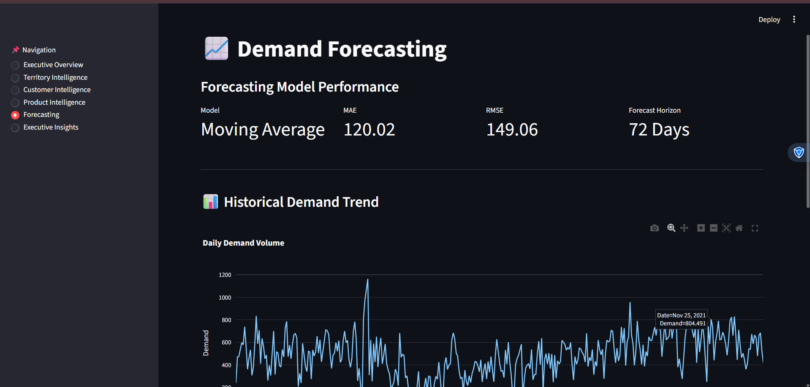
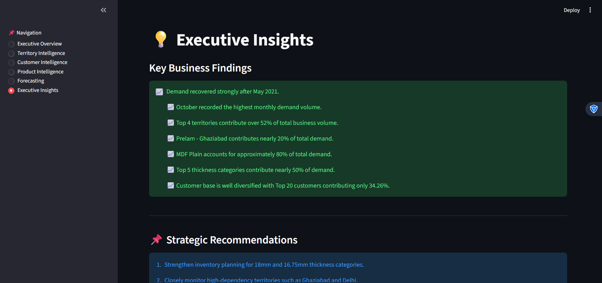

# Manufacturing Demand Intelligence Platform

## Overview

The Manufacturing Demand Intelligence Platform is an end-to-end Business Intelligence and Demand Forecasting solution developed using real-world manufacturing sales data. The project focuses on transforming raw transactional data into actionable business insights through analytics, visualization, forecasting, and executive decision support.

This project was inspired by learnings from my Century Ply internship and aims to demonstrate practical skills in Data Analytics, Business Intelligence, KPI Monitoring, Forecasting, and Dashboard Development.

---

## Business Problem

Manufacturing organizations generate large volumes of sales and distribution data every day. Without a centralized analytics platform, it becomes difficult to:

* Monitor demand trends
* Identify top-performing territories
* Analyze customer concentration
* Understand product demand patterns
* Forecast future demand
* Support executive decision-making

This platform addresses these challenges through interactive analytics and forecasting.

---

## Dataset Overview

### Dataset Size

* Records: 78,350+
* Customers: 626
* Territories: 69
* Materials: 5,055
* Divisions: 2

### Key Features

* Customer Information
* Territory Information
* Material Information
* Division Information
* Thickness Information
* Invoice Dates
* Sales Volume (CBM)

---

## Project Architecture

```text
Raw Manufacturing Data
        │
        ▼
Data Cleaning & Validation
        │
        ▼
Feature Engineering
        │
        ▼
Business Analytics Layer
        │
 ┌──────┼──────┐
 ▼      ▼      ▼
Customer Territory Product
Analytics Analytics Analytics
        │
        ▼
Forecasting Engine
        │
        ▼
Executive Insights
        │
        ▼
Streamlit Dashboard
```

---

## Key Features

### Executive Overview

* KPI Monitoring
* Monthly Demand Trend
* Division Contribution Analysis
* Top Territory Analysis

### Territory Intelligence

* Territory Ranking
* Territory Contribution Analysis
* Territory Performance Monitoring
* Demand Distribution

### Customer Intelligence

* Top Customer Analysis
* Customer Contribution Analysis
* Customer Concentration Risk Assessment
* Customer Ranking Dashboard

### Product Intelligence

* Division Analysis
* Material Analysis
* Thickness Analysis
* Product Demand Insights

### Demand Forecasting

* Daily Demand Forecasting
* Moving Average Forecast Model
* Exponential Smoothing Comparison
* Forecast Evaluation using MAE and RMSE

### Executive Insights

* Automated Business Findings
* Strategic Recommendations
* Demand Trend Analysis
* Business Performance Summary

---

## Dashboard Screenshots

## Dashboard Screenshots

### Executive Overview



### Territory Intelligence



### Customer Intelligence



### Product Intelligence



### Forecasting



### Executive Insights


---

## Key Business Insights

### Territory Analysis

* Top 4 territories contribute over 52% of total business volume.
* Prelam - Ghaziabad contributes approximately 19.63% of total demand.

### Customer Analysis

* Top 10 customers contribute 23.46% of total volume.
* Top 20 customers contribute 34.26% of total volume.
* Customer demand is relatively diversified, reducing dependency risk.

### Product Analysis

* MDF Plain contributes approximately 80% of total volume.
* Top 5 thickness categories contribute nearly 50% of demand.

### Demand Trends

* Significant demand decline observed during April-May 2021.
* Strong recovery observed from June onwards.
* October recorded the highest monthly demand volume.

---

## Forecasting Results

### Model Comparison

| Model                 | MAE    | RMSE   |
| --------------------- | ------ | ------ |
| Moving Average        | 120.02 | 149.06 |
| Exponential Smoothing | 200.76 | 251.62 |

### Best Performing Model

**Moving Average Forecast**

* MAE: 120.02
* RMSE: 149.06

The Moving Average model provided better forecasting performance for this dataset and was selected as the preferred forecasting approach.

---

## Technology Stack

### Programming

* Python

### Data Analysis

* Pandas
* NumPy

### Visualization

* Plotly
* Matplotlib
* Seaborn

### Dashboard Development

* Streamlit

### Forecasting

* Moving Average
* Exponential Smoothing

### Development Environment

* VS Code
* Jupyter Notebook

---

## How to Run


### Install Dependencies

```bash
pip install -r requirements.txt
```

### Run Dashboard

```bash
python -m streamlit run dashboard.py
```

---

## Project Structure

```text
manufacturing-demand-intelligence-platform/

│
├── dashboard.py
├── sales_cleaned.csv
├── requirements.txt
├── README.md
│
├── screenshots/
│   ├── executive_overview.png
│   ├── territory_intelligence.png
│   ├── customer_intelligence.png
│   ├── product_intelligence.png
│   ├── forecasting.png
│   └── executive_insights.png
│
├── reports/
│
├── notebooks/
│   ├── Data_Audit.ipynb
│   ├── Data_Cleaning.ipynb
│   ├── EDA.ipynb
│   └── Forecasting.ipynb
```

---

## Future Enhancements

* Real-time Demand Monitoring
* Inventory Optimization Module
* Territory-wise Demand Forecasting
* Automated PDF Report Generation
* Advanced Forecasting Models
* Supply Chain Analytics Integration

---

## Author

**Abhishek Bharadwaj**

B.Tech Electronics and Communication Engineering
VIT University

Interested in:

* Data Analytics
* Business Intelligence
* Product Analytics
* Applied AI
* Agentic AI Systems

---

### Project Impact

This project demonstrates practical experience in:

* Data Cleaning & Transformation
* Business Analytics
* KPI Development
* Demand Forecasting
* Dashboard Development
* Executive Reporting
* Decision Support Systems

This project was developed as a portfolio-grade Business Intelligence solution using real manufacturing sales data. 🚀


Then I'll rate the project as if I were a recruiter hiring for a **Data Analyst / BI Analyst internship or placement role**.
